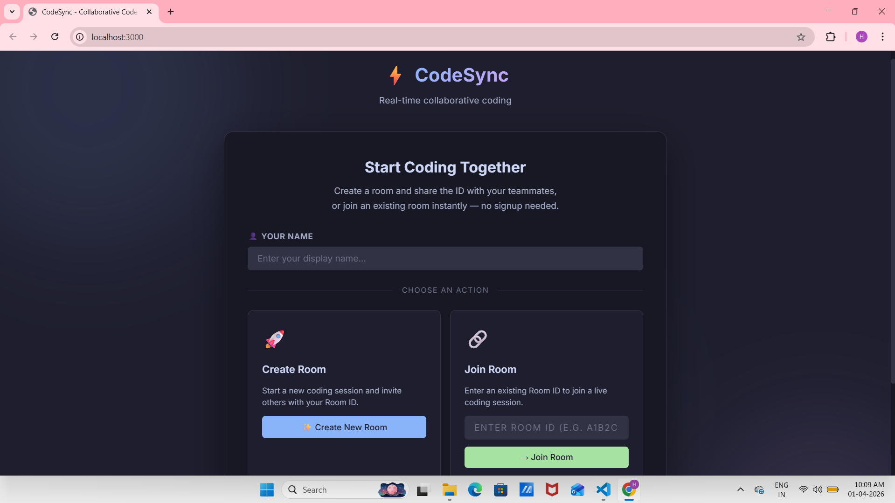
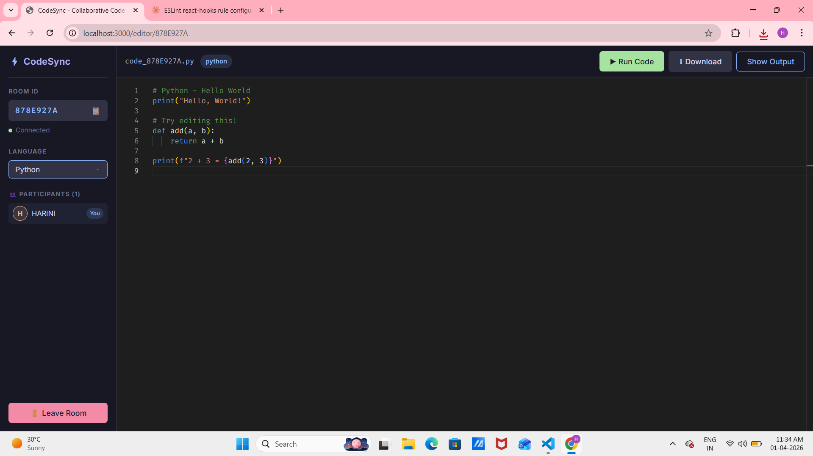
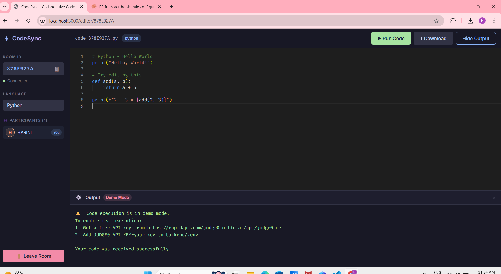

# ⚡ CodeSync — Collaborative Code Editor

A beginner-friendly **real-time collaborative code editor** built with the MERN stack
(MongoDB, Express.js, React.js, Node.js) + Socket.io.

---

## 🚀 Features

| Feature | Description |
|---|---|
| 🔗 **Room System** | Create or join rooms with a unique 8-char Room ID |
| ⚡ **Real-time Sync** | Code changes broadcast instantly via Socket.io |
| 🖊️ **Monaco Editor** | VS Code-powered editor with syntax highlighting |
| 🌍 **Multi-language** | JavaScript, TypeScript, Python, Java, C++, C |
| ▶️ **Run Code** | Execute code via Judge0 API and see output instantly |
| ⬇️ **Download** | Download your code as a properly named file |
| 👥 **User List** | See who's in the room in real time |
| 💾 **MongoDB** | Optional room persistence with MongoDB |

---

## 📸 Screenshots

### 🏠 Home Page


### 💻 Editor Page


### ▶️ Output Panel



---

## 📁 Folder Structure

```
collaborative-code-editor/
├── backend/
│   ├── server.js          ← Express + Socket.io server
│   ├── package.json
│   └── .env.example       ← Copy to .env and fill in values
│
├── frontend/
│   ├── public/
│   │   └── index.html
│   ├── src/
│   │   ├── components/
│   │   │   ├── UserList.js      ← Connected users display
│   │   │   ├── UserList.css
│   │   │   ├── OutputPanel.js   ← Code execution output
│   │   │   └── OutputPanel.css
│   │   ├── pages/
│   │   │   ├── HomePage.js      ← Create/Join room landing page
│   │   │   ├── HomePage.css
│   │   │   ├── EditorPage.js    ← Main editor with all features
│   │   │   └── EditorPage.css
│   │   ├── styles/
│   │   │   └── global.css       ← Global CSS variables & utilities
│   │   ├── socket.js            ← Socket.io client singleton
│   │   ├── App.js               ← Root component + router
│   │   └── index.js             ← React entry point
│   └── package.json
│
├── screenshots/               ← Add your screenshots here
└── README.md
```

---

## ⚙️ Setup Instructions

### Prerequisites
- Node.js v18+ — https://nodejs.org
- npm v9+
- MongoDB (optional) — https://www.mongodb.com/try/download/community

---

### 1️⃣ Clone / Download the Project

```bash
git clone <your-repo-url>
cd collaborative-code-editor
```

---

### 2️⃣ Backend Setup

```bash
cd collaborative-code-editor
cd backend
npm install
cp .env.example .env
npm start
```

The backend will start at: **http://localhost:5000**

---

### 3️⃣ Frontend Setup

Open a **new terminal** window:

```bash
cd collaborative-code-editor
cd frontend
npm install
npm start
```

The frontend will open at: **http://localhost:3000**

---

### 4️⃣ (Optional) Enable Real Code Execution

By default, the "Run Code" button works in **demo mode**.

To enable real execution:
1. Sign up at https://rapidapi.com
2. Subscribe to **Judge0 CE** API (free tier)
3. Add to `backend/.env`:
   ```
   JUDGE0_API_KEY=your_rapidapi_key_here
   ```
4. Restart the backend

---

### 5️⃣ (Optional) MongoDB Setup

MongoDB is **optional** — the app works fully in-memory without it.

```
MONGO_URI=mongodb://localhost:27017/code-editor
```

---

## 🎮 How to Use

1. Open http://localhost:3000
2. Enter your display name
3. Click **"✨ Create New Room"**
4. Share the Room ID with a friend
5. They enter the Room ID and click **"→ Join Room"**
6. Both users now see the same editor — start typing!
7. Click **"▶ Run Code"** to execute code
8. Click **"⬇ Download"** to save code locally

---

## 🛠️ Tech Stack

| Layer | Technology |
|---|---|
| Frontend | React 18, React Router v6 |
| Editor | Monaco Editor (@monaco-editor/react) |
| Real-time | Socket.io (client + server) |
| Backend | Node.js, Express.js |
| Database | MongoDB + Mongoose (optional) |
| Code Execution | Judge0 CE API via RapidAPI |
| Notifications | react-hot-toast |
| HTTP Client | Axios |

---

## 🔌 API Endpoints

| Method | Endpoint | Description |
|---|---|---|
| GET  | `/` | Health check |
| POST | `/api/room/create` | Create a new room |
| GET  | `/api/room/:roomId` | Get room data |
| POST | `/api/execute` | Execute code |

---

## 📡 Socket.io Events

| Direction | Event | Payload | Description |
|---|---|---|---|
| Client → Server | `join-room` | `{ roomId, username }` | Join a room |
| Client → Server | `code-change` | `{ roomId, code }` | Broadcast code update |
| Client → Server | `language-change` | `{ roomId, language }` | Broadcast language change |
| Client → Server | `leave-room` | `{ roomId }` | Leave a room |
| Server → Client | `room-joined` | `{ code, language, users }` | Initial room state |
| Server → Client | `code-update` | `{ code }` | Receive remote code change |
| Server → Client | `language-update` | `{ language }` | Receive language change |
| Server → Client | `user-joined` | `{ users, username }` | Someone joined |
| Server → Client | `user-left` | `{ users, username }` | Someone left |

---

## 🔮 Future Enhancements

| Feature | Description |
|---|---|
| 🔐 **User Authentication** | Login/signup with JWT so users have persistent profiles |
| 💬 **In-editor Chat** | Real-time chat panel alongside the code editor |
| 🎨 **Theme Selector** | Switch between dark, light, and custom editor themes |
| 🖱️ **Live Cursors** | See other users' cursor positions in real time |
| 📂 **File System** | Support multiple files and folders within a room |
| 🔊 **Voice/Video Call** | WebRTC-powered audio/video for pair programming |
| 📝 **Code Review Mode** | Inline comments and annotations on code lines |
| 🕘 **Version History** | Save and restore previous snapshots of the code |
| 🌐 **Deploy to Cloud** | Host on AWS / Render / Vercel for public access |
| 📱 **Mobile Responsive** | Optimized layout for tablets and mobile devices |

---

## 🐛 Troubleshooting

**"Failed to create room. Is the backend running?"**
→ Make sure the backend is running on port 5000 (`cd backend && npm start`)

**Monaco Editor not loading**
→ Run `npm install` in the frontend folder again

**Socket not connecting**
→ Check that the proxy in `frontend/package.json` points to `http://localhost:5000`

**MongoDB connection error**
→ MongoDB is optional — the app works without it. Ignore the warning.

---

## 📜 License

MIT — Free to use, modify, and distribute.
